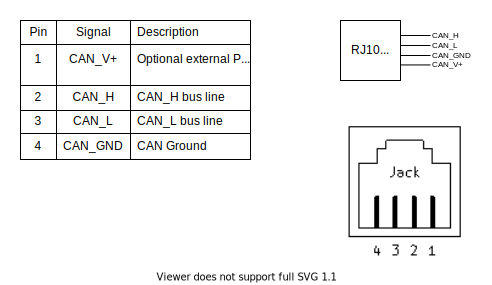
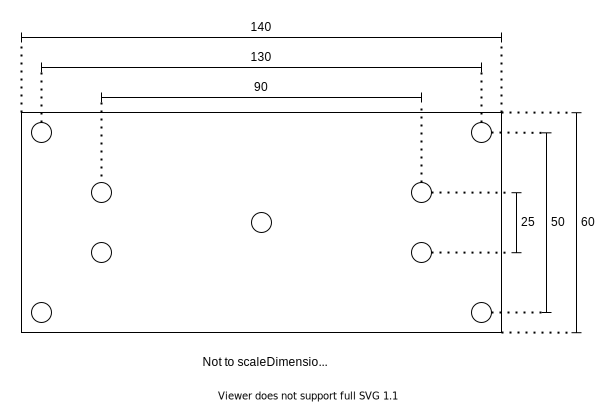

CAN Distributor, to simplify connecting things to the CAN bus.

## RJ10 Pinout (4P4C)

Equivalent with RJ22.
Pinout is based on the CANOpen standard, as specified in:

https://www.phoenixcontact.com/assets/downloads_ed/global/web_dwl_technical_info/CANopen.pdf

## RJ45 Pinout (8P8C)

Pinout is based on the CANOpen standard, as specified in:

https://www.phoenixcontact.com/assets/downloads_ed/global/web_dwl_technical_info/CANopen.pdf

## Board Concept

Each distribution card delivers CAN and optionally power to its Nodes. Power is only distributed over the
Node ports. This is to avoid any complex problems regarding PSU load sharing, ground loops, etc...
Power is indicated by PWR_LED. Voltage and allowable current draw depends on the connected PSU.

It is not reasonable to draw more than 200/300 mA over the RJ10 cables.

The board has a footprint for a termination resistor, which may be populated. **The resistor should only be
populated if the board is at one of the two edges of the CAN network.**

The Main ports and Node ports use different connectors to avoid plugging them wrong. The RJ10 ports may 
either be populated with TE Connectivity's vertical [5520257-2](https://www.te.com/usa-en/product-5520257-2.html) connectors or horizontal [1-1705949-1](https://www.te.com/usa-en/product-1-1705949-1.html) connectors.

## Mechanical

All mounting holes are for M3.

The board can be mounted to a DIN rail using Phoenix Contact's [1201578](https://www.phoenixcontact.com/online/portal/se?uri=pxc-oc-itemdetail:pid=1201578&library=sesv&tab=1&selectedCategory=ALL) or [1200993](https://www.phoenixcontact.com/online/portal/se?uri=pxc-oc-itemdetail:pid=1200993&library=sesv&tab=1&selectedCategory=ALL) rail adapters.
In that case the board is screwed to the adapters using self tapping M3 plastic screws.

